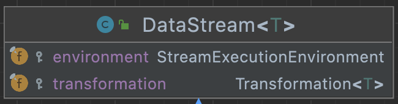
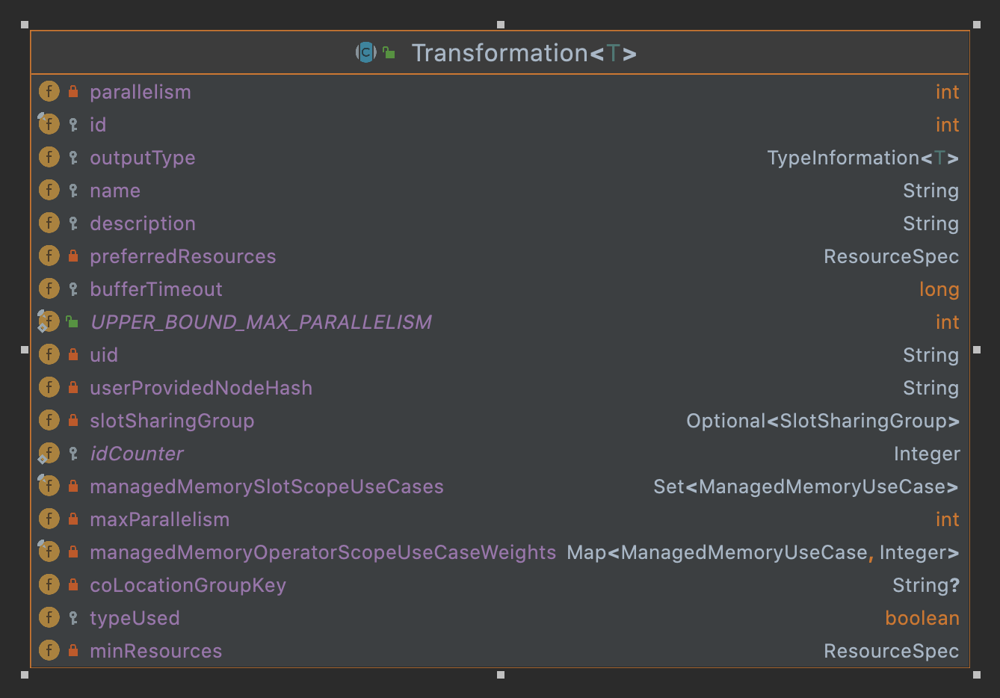
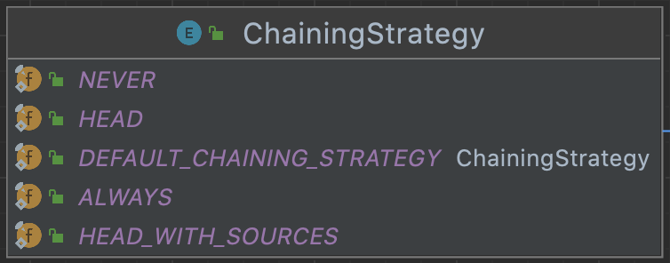
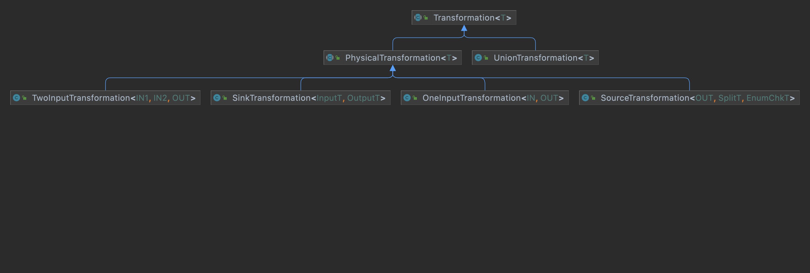
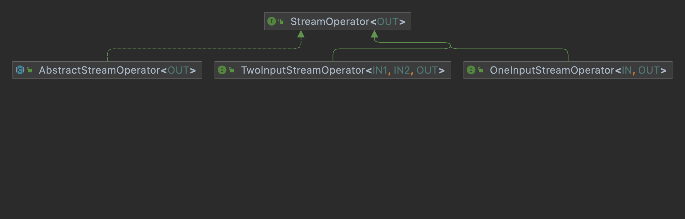
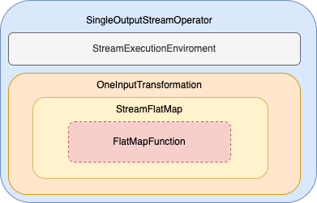

近期在系统的学习Flink，希望通过对Flink底层源码的学习来更深入了解Flink的相关实现逻辑。这里新开一个Flink源码解析的系列来深入介绍底层源码逻辑。说明：这里默认相关读者具备Flink相关基础知识和开发经验，所以不会过多介绍相关的基础概念相关内容，Flink使用的版本为1.15.2。初步确定按如下几个大的方面来介绍

* 计算模型
  * DataStream基础框架
* 部署&调度
* 存储体系
* 底层支撑

# 概览

本篇是第一篇，介绍计算模型的基础DataStream的相关内容，这一篇只介绍DataStream的基础内容，如如何实现相关的操作，数据结构等，不会涉及到窗口、事件事件和状态等信息

DataStream是对数据流的一个抽象，其提供了丰富的操作算子(例如过滤、map、join、聚合、定义窗口等)来对数据流进行处理，下图描述了Flink中源数据通过DataStream的转换最后输出的整个过程。


通过上图可以来构想下，一般一个DataStream具有如下主要属性


| 属性 | 说明 |
| --- | --- |
| 上游依赖 | 标识上游依赖信息，这样能把整个处理流程串联起来 |
| 并行度 | 处理逻辑的并行度信息，这样可以提高处理的速度 |
| 输入格式 | 指定输入数据的格式，如InnerType {<br>public int id;<br>public String text;<br>} |
| 输出格式 | 指定输出数据的格式 |
| 处理逻辑 | 上游datastream转换到目前的datastream的具体逻辑操作，如map的具体逻辑信息。 |

最终整个数据流会生成一个DAG图(有向无环图)，通过这个DAG图就可以生成对应的任务来运行了。下面来具体分析DataStream的实现和生成DAG图(Flink中叫Graph)

# 深入DataStream

首先我们通过下图来看看，DataStream中的一些主要的辅助类，DataStream类本身主要逻辑是对各类转换关系和sink的操作，而前面说到的一些主要属性信息都是通过辅助类来处理的。


**Transformation**:本身主要管理了输出格式、上游依赖、并行度、id编号等信息以及StreamOperator的工厂类(StreamOperatorFactory)

**StreamOperator**:主要是各类操作的具体处理逻辑

**Function**:用户自定义函数的接口，如DataStream中map处理时需要传入的MapFunction就是Function的子接口

## DataStream

### 属性和方法

DataStream的属性比较简单，就2个，1个是实行的环境信息，另一个是Transformation。
DataStream中的方法主要分为以下几类
*  **基础属性信息**：如获取并行度，id，输出格式等,大多数是代理来调用Transformation中对应的方法
* **转换操作**：各类的转换处理，如map、filter、shuffle、join等
* **输出处理**：各类输出的sink处理，如保存为文本等，不过大多数方法都不推荐使用了，这里主要的方法是addSink()
* **触发执行**: 如executeAndCollect，内部是调用了env.executeAsync来执行streaming dataflow
  
除了转换操作外，其他几类的逻辑都比较直观和简单，这里重点介绍下转换操作的处理，转换操作这里分为3类，1.返回是一个DataStream。如map、filter、union、keyBy等；2.返回的是一个Streams，即输入是多个DataStream，这类的操作主要是多流关联的操作，如join、coGroup。这些Streams的类中实现了一些方法，来返回一个DataStream; 3.window类，返回的是AllWindowedStream类型,同样这些类中也是有方法，来返回一个DataStream。

说明:如上的各个分类都是个人基于理解上做的各个分类处理，非官方定义

### 类体系

DataStream的类图关系比较简单，就如下这几个类，具体每个子类的信息见下表


| 子类名 | 说明 |
| --- | --- |
| SingleOutputStreamOperator | 只有1个输出的DataStream |
| IterativeStream | 迭代的DataStream，具体使用场景后面分析 |
| DataStreamSource | 最开始的DataStream，里面有source的信息 |
| KeyedStream | 有一个Key信息的DataStream |


## Transformation
### 属性和方法
DataStream类本身主要是提供了给外部的编程接口的支持，而对Streaming flow算子节点本身的一些属性和操作则由Transformation来负责

从上图可以看出其主要属性有节点id，名称，并行度，输出类型还有一些与资源相关的内容，还有一个是上游的输入Transformation,由于这个因不同的Transformation会有不同的数据个数，所以这个信息是放在各个子类中的。如ReduceTransformation是有一个input属性来记录上游依赖，而如TwoInputTransformation则是有2个属性input1和input2来记录上游依赖，另外如SourceTransformation，这个是源头的Transformation，是没有上游依赖的Transformation，所以没有属性来记录，但是有个Source属性来记录Source输入
具体对数据的操作处理，在Transformation里面有个StreamOperatorFactory属性，其中的StreamOperator实现了各种的处理算子。注意这里不是所有的Transformation都包含StreamOperatorFactory,如SourceTransformation中就没有，这个具体大家可以看看相关的代码。

Transformation的方法基本上是对上述属性的get和set操作，这里重点要说明一下的是PhysicalTransformation(下面类体系来介绍)中的setChainingStrategy方法，这里的ChainingStrategy是一个枚举类，主要是控制多个连续的算子是否可以进行链式处理，这个具体的我们在下面介绍StreamGraph时再介绍


### 类体系

Transformation的大多数类均为PhysicalTransformation的子类，PhysicalTransformation为有物理操作的，重点是这类的子类是支持Chaining操作的。我们先来看看其重要子类
| 子类名 | 说明 |
| --- | --- |
|SourceTransformation|连接Source的Transformation，是整个streaming flow的最开始的转换处理|
|SinkTransformation|输出的转换处理，是整个streaming flow的最后一个|
|OneInputTransformation|只有1个输入的转换处理，如map、filter这类的处理|
|TwoInputTransformation|有2个输入的转换处理|

## StreamOperator
### 属性和方法
StreamOperator负责对数据进行处理的具体逻辑，如map处理的StreamMap，由于各个Operator的处理方式的不同，这里主要以AbstractStreamOperator来介绍一些主要的属性，如output的数据，StreamConfig，StreamingRuntimeContext等。下面我们重点介绍下相关的方法
StreamOperator接口有定义了重要的3个方法(这里只介绍与数据基础处理相关的部分)
| 方法 | 说明 |
| ---- | ---- |
|open()|数据处理的前处理，如算子的初始化操作等|
|finish()|数据处理的后处理，如缓存数据的flush操作等|
|close()|该方法在算子生命周期的最后调用，不管是算子运行成功还是失败或者取消，主要是对算子使用到的资源的各种释放处理|
另外关注的对数据进行实际处理的方法，
|接口|方法|说明|
| --- | --- | --- |
|OneInputStreamOperator|processElement()|对数据元素进行处理,实际该接口在OneInputStreamOperator的父接口Input中定义|
|TwoInputStreamOperator|processElement1()|对input1的数据元素进行处理|
| |processElement2()| 对input2的数据元素进行处理|

### 类体系
StreamOpterator的子类非常多，包括测试类的一起有287个，这些大致可以归属到如下3个子类中，

|类名|说明|
| --- | --- |
|OneInputStreamOperator|只有1个输入的源|
|TwoInputStreamOperator|有2个输入源|
|AbstractStreamOperator|

## Function
Function是针对所有的用户自定义的函数，各子类主要是实现对应的，这里定义了种类丰富的各类Function的子接口类来适配各种不同的加工场景，具体的就看源码了，这里就不详细介绍了

本节的最后，我们通过一个例子来看看这几个类是怎么组合的。如下是一个常见的对DataStream进行map处理的操作
```
      text
        .flatMap(new Tokenizer)
```
处理后对应的DataStream的结构如下图


# DataStream生成提交执行的Graph
前面分析了DataStream，是单个节点的，接下来看看整个streaming flow在flink中是怎么转换为可以执行的逻辑的。一般整个数据流我们叫做DAG，那在Flink中叫PipeLine，其实现类是StreamGraph。这里先介绍2个概念
* StreamNode：streaming流中的一个节点，代表对应的算子
* StreamEdge：Graph中的边，来连接上下游的StreamNode

如上图所示，圆形为StreamNode,箭头为StreamEdge,这样通过这2者就可以构建一个StreamGraph了。
StreamGraph是最原始的Graph，而其中会做一些优化生成JobGraph，最后会生成待执行的ExecutionGraph，这里我们先介绍下基础概念，后面会深入介绍相关的内容。
* JobGraph: 优化后的StreamGraph，具体做的优化就是把相连的算子，如果支持chaining的，合并到一个StreamNode;
* ExecutionGraph: 和JobGraph结构一致

## StreamGraph
下面我们来看看StreamGraph的主要属性和方法，以及如何从DataStream转换为StreamGraph的。
### 属性和方法
重要属性如下(这里只介绍与生成图相关的属性，还有一些如状态，存储类的后面介绍)
|属性|说明|
| --- | --- |
|Map<Integer, StreamNode> streamNodes| StreamNode数据，kv格式，key为Transformation的id|
|Set<Integer> sources|StreamGraph的所有source集合，存储的是Transformation的id|
|Set<Integer> sinks|StreamGraph的sink集合|
说明：StreamGraph只记录了StreamNode的信息，StreamEdge的信息是记录在StreamNode中的。如下2个属性记录了StreamNode的输入Edge和输出Edge
```
    //StreamNode.java
    private List<StreamEdge> inEdges = new ArrayList<StreamEdge>();
    private List<StreamEdge> outEdges = new ArrayList<StreamEdge>();
```
主要方法
| 方法 | 说明 |
| --- | --- |
|addSource()|添加source节点|
|addSink() | 添加sink节点|
|addOperator()| 添加算子节点|
|addVirtualSideOutputNode()|添加一个虚拟的siteOutput节点|
### StreamGraph生成
下面我们来看看DataStream是如何生成StreamGraph的。通过前面对DataStream的分析可知，DataStream的前后依赖关系是通过Transformation来存储的，这里StreamExecutionEnvironment有个transformations记录了所有的Transformation
```
    //StreamExecutionEnvironment.java
    List<Transformation<?>> transformations
```
这里的数据是在DataStream进行转换处理生成了新的Transformation，同时会把该实例添加到transformations里面，使用的是如下方法
```
    getExecutionEnvironment().addOperator(resultTransform);
```
而具体转换为StreamGraph是通过StreamExecutionEnvironment的 getStreamGraph()方法。最终转换的逻辑是通过StreamGraphGenerator类来实现。
这里要介绍一个新的类体系TransformationTranslator，有各种的子类来转换对应类型的Transformation。这里有定义了2个方法分别支持转换Streaming和Batch。
```
 //TransformationTranslator.java
 Collection<Integer> translateForBatch(final T transformation, final Context context);
 Collection<Integer> translateForStreaming(final T transformation, final Context context);
```
对应的映射关系存储在StreamGraphGenerator类的translatorMap中。
```
//StreamGraphGenerator.java 
private static final Map<
                    Class<? extends Transformation>,
                    TransformationTranslator<?, ? extends Transformation>>
            translatorMap;
static {
        @SuppressWarnings("rawtypes")
        Map<Class<? extends Transformation>, TransformationTranslator<?, ? extends Transformation>>
                tmp = new HashMap<>();
        tmp.put(OneInputTransformation.class, new OneInputTransformationTranslator<>());
        tmp.put(TwoInputTransformation.class, new TwoInputTransformationTranslator<>());
        tmp.put(MultipleInputTransformation.class, new MultiInputTransformationTranslator<>());
        tmp.put(KeyedMultipleInputTransformation.class, new MultiInputTransformationTranslator<>());
        tmp.put(SourceTransformation.class, new SourceTransformationTranslator<>());
        tmp.put(SinkTransformation.class, new SinkTransformationTranslator<>());
    ...
```
下面我们通过OneInputTransformationTranslator为例来看看是如何进行转换的。具体逻辑如下
```
 //调用addOperator添加StreamNode
 streamGraph.addOperator(
                transformationId,
                slotSharingGroup,
                transformation.getCoLocationGroupKey(),
                operatorFactory,
                inputType,
                transformation.getOutputType(),
                transformation.getName());
//获取上游依赖的transformations,然后添加边
        final List<Transformation<?>> parentTransformations = transformation.getInputs();
        for (Integer inputId : context.getStreamNodeIds(parentTransformations.get(0))) {
            streamGraph.addEdge(inputId, transformationId, 0);
        }
```
除了添加节点和边外，还有一些如设置节点的并行度等操作，这块大家可以去看看具体的代码。
这样当把所有的Transformation都转换完，这样StreamGraph就生成好了。

## JobGraph
有了StreamGraph，为什么还需要一个JobGraph呢，这个和Spark中的Stage类似，如果有多个算子能够合并到一起处理，那这样性能可以提高很多。所以这里根据一定的规则进行，先我们介绍相关的类
* JobVertex:job的顶点，即对应的计算逻辑(这里用的是Vertex, 而前面用的是Node，有点差异),通过inputs记录了所有来源的Edge，而输出是ArrayList<IntermediateDataSet>来记录
* JobEdge: job的边，记录了源Vertex和目标Vertex.
* IntermediateDataSet: 定义了一个中间数据集，但并没有存储，只是记录了一个Producer(JobVertex)和一个Consumer(JobEdge)
主要的概念就这些，下面我们看看JobGraph的结构以及如何从StreamGraph转换为JobGraph
### 属性和方法
JobGraph的属性主要是通过Map<JobVertexID, JobVertex> taskVertices记录了JobVertex的信息。
另外这个JobGraph是提交到集群去执行的，所以会有一些执行相关的信息，相关的如下：
```
    private JobID jobID;

    private final String jobName;
    
    private SerializedValue<ExecutionConfig> serializedExecutionConfig;

    /** Set of JAR files required to run this job. */
    private final List<Path> userJars = new ArrayList<Path>();

     /** Set of custom files required to run this job. */
    private final Map<String, DistributedCache.DistributedCacheEntry> userArtifacts =
            new HashMap<>();

    /** Set of blob keys identifying the JAR files required to run this job. */
    private final List<PermanentBlobKey> userJarBlobKeys = new ArrayList<>();

    /** List of classpaths required to run this job. */
    private List<URL> classpaths = Collections.emptyList();
```
而相关的方法主要是
| 方法 | 说明|
| --- | --- |
|addVertex() | 添加顶点|
|getVertices() | 获取顶点|
而如何从StreamGraph转换到JobGraph这块的内容还是比较多，这块后续我们单独开一篇来介绍

# 总结
本篇从0开始介绍了DataStream的相关内容，并深入介绍了DataStream、Transformation、StreamOperator和Function之间的关系。另外介绍了streaming flow转换为提交执行的StreamGraph的过程及StreamGraph的存储结构。而从StreamGraph->JobGraph->ExecutionGraph这块涉及的内容也较多，且还涉及到提交部署的内容，这块后面单独来介绍。最后本篇介绍的DataStream只是介绍了最基础的计算框架，没有涉及到flink的streaming flow中的时间、状态、window等内容，这块我们下一篇来介绍。