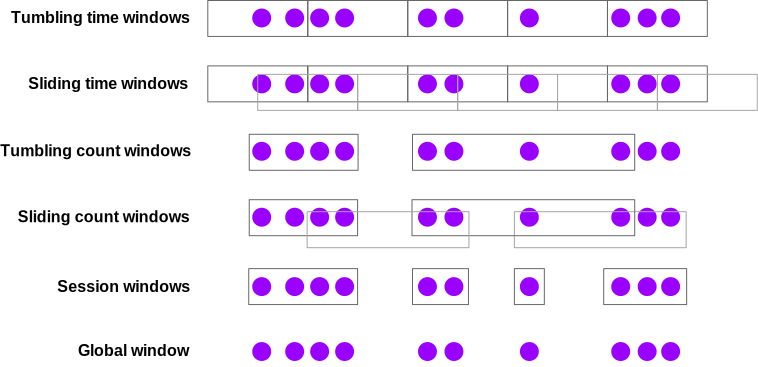

* 计算模型
  * DataStream基础框架
  * 事件时间和窗口
* 部署&调度
* 存储体系
* 底层支撑

# 概览
在实时计算处理时，需要跟时间来打交道，如实时风控场景的时间行为序列，实时分析场景下的时间窗口统计等。而由于网络等问题，会导致处理时的数据存在乱序问题，Flink通过吸收Google Dataflow/Bean的编程模型思想，提供了灵活的处理方式，本篇来分析下Flink中具体提供的功能和底层机制。

# 时间
Flink中提供了3种时间类型来满足不同场景的需求，即处理时间、事件时间和接入时间
  * **处理时间(Processing time)**:数据在流式系统中处理时的机器系统时间
  * **事件时间(Event time)**:每条单独的事件在产出设备上发生的时间，即事件实际发生的时间。这个时间保存在发送给Flink系统的数据记录中
  * **接入时间(Ingestion time)**:Flink读取事件时的时间
下图是Flink官方文档中3个时间的标识


而在使用事件时间的场景下，需要一种方式来度量目前处理的事件时间，如使用事件时间窗口时，需要知道什么时候来关闭这个窗口，所以这里引入了Watermark的机制。
这里先介绍Watermark关联的3个概念
  * **WatermarkStrategy**:org.apache.flink.table.sources.wmstrategies.WatermarkStrategy,定义怎么在DataStream中去生成Watermark的策略,其子类有定义了多种不同的策略
  * **WatermarkGenerator**:具体生成Watermark的生成器类
  * **TimestampAssigner**:从数据记录中提取时间戳

## 重要类
### WatermarkStrategy
Flink中提供了一些常用的watermark策略，主要我们看看PeriodicWatermarkAssigner这个策略，周期性水位策略，其有2个子类
  * **BoundedOutOfOrderTimestamps**:没有顺序的数据，指定对应的延迟来产生watermark，产生的watermark为获取的数据中的最大时间-指定的delay
  * **AscendingTimestamps**:对于有顺序的数据使用，产生的watermark为获取的数据中最大的时间-1

### WatermarkGenerator
WatermarkGenerator接口有2个方法
```
@Public
public interface WatermarkGenerator<T> {

    /**
     * 每来一条事件数据调用一次，可以检查或者记录事件的时间戳，或者也可以基于事件数据本身去生成 watermark。
     */
    void onEvent(T event, long eventTimestamp, WatermarkOutput output);

    /**
     * 周期性的调用，也许会生成新的 watermark，也许不会。
     *
     * <p>调用此方法生成 watermark 的间隔时间由 {@link ExecutionConfig#getAutoWatermarkInterval()} 决定。
     */
    void onPeriodicEmit(WatermarkOutput output);
}
```
watermark生成的方式分为2种：周期性生成和标记生成
周期性生成的通过onEvent()方法来更新最大时间戳，而在框架调用onPeriodicEmit()时发出watermark
标记生成通过onEvent()来处理，如果有满足条件的记录出现，就发出watermark

### TimerService
如何获取当前的处理时间和watermark呢，这个在Flink中通过TimerService来负责，下面先看看这个接口的相关方法
```
    //返回当前处理时间
    /** Returns the current processing time. */
    long currentProcessingTime();

    //返回当前事件时间watermark
    /** Returns the current event-time watermark. */
    long currentWatermark();

    //注册一个timer，当事件时间水位超过给定时间时触发
    void registerEventTimeTimer(long time);
```
上面介绍了时间和watermark相关的重要类，下面通过一个例子把这些串联起来，看其是如何来运转的

## 处理逻辑
我们以Flink官方文档中的watermark代码例子结合来介绍
```
WatermarkStrategy<Event> strategy = WatermarkStrategy
        .<Event>forBoundedOutOfOrderness(Duration.ofSeconds(20))
        .withTimestampAssigner((event, timestamp) -> event.timestamp);

DataStream<Event> withTimestampsAndWatermarks =
    stream.assignTimestampsAndWatermarks(strategy);
```
这里通过WatermarkStrategy.forBoundedOutOfOrderness(Duration.ofSeconds(20))生成了一个延迟为20秒的有界限的watermark策略，然后指定了TimestampAssigner为时间戳为事件的timestamp字段。
stream.assignTimestampsAndWatermarks方法返回的是一个DataStream，通过第一篇的介绍，这里对应有一个Transformation(TimestampsAndWatermarksTransformation)，同时也对应有一个StreamOperator(TimestampsAndWatermarksOperator, 注意这个是在Translator(TimestampsAndWatermarksTransformationTranslator)中定义的),我们看看具体的watermark在TimestampsAndWatermarksOperator中的处理逻辑如何
```
    public void open() throws Exception {
        super.open();

        timestampAssigner = watermarkStrategy.createTimestampAssigner(this::getMetricGroup);
        // 创建watermarkGenerator
        watermarkGenerator =
                emitProgressiveWatermarks
                        ? watermarkStrategy.createWatermarkGenerator(this::getMetricGroup)
                        : new NoWatermarksGenerator<>();

        wmOutput = new WatermarkEmitter(output);

        //获取周期性watermark的调度周期
        watermarkInterval = getExecutionConfig().getAutoWatermarkInterval();
        if (watermarkInterval > 0 && emitProgressiveWatermarks) {
            final long now = getProcessingTimeService().getCurrentProcessingTime();
            // 获取timerService 注册Timer
            getProcessingTimeService().registerTimer(now + watermarkInterval, this);
        }
    }
  ```
  在StreamOperator的前处理方法中，创建了WatermarkGenerator，然后获取watermark触发周期，注册到TimerService里面
  后续再StreamOperator的每条数据处理方法中(processElement)调用了
  ```
  watermarkGenerator.onEvent(event, newTimestamp, wmOutput);
  ```
  这里实际会更新最大事件时间戳
  而前面注册Timer时会传入一个ProcessingTimeCallback对象，该接口有个onProcessingTime方法，而TimestampsAndWatermarksOperator实现了该接口
  ```
  // ProcessingTimeCallback.java
  ScheduledFuture<?> registerTimer(long timestamp, ProcessingTimeCallback target);
```

```
//TimestampsAndWatermarksOperator.java
    @Override
    public void onProcessingTime(long timestamp) throws Exception {
        // 发送watermark
        watermarkGenerator.onPeriodicEmit(wmOutput);

        // 更新下次触发时间
        final long now = getProcessingTimeService().getCurrentProcessingTime();
        getProcessingTimeService().registerTimer(now + watermarkInterval, this);
    }
  ```
这里通过回调，触发发送watermark和再次注册下一个调度时间点,而下游算子收到了watermark如何处理呢，如在window算子里面，回去更新算子里面TimerService的currentWatermark，这样如果新数据小于当前watermark那就会丢掉或按siteOutput处理，具体我们再分析窗口时再介绍。

# 窗口
在实际场景中有很多对一段时间的数据来进行处理的需求，Flink中提供了不同种类的窗口来支持

具体的类型有
* **滚动窗口**:按固定的区间划分，各个之间不重叠，如近1分钟的页面访问量
* **滑动窗口**:按固定区间划分，但窗口间会存在重叠，如每10秒计算近1分钟的页面访问量
* **会话窗口**:超过一段时间该窗口没有数据则视为该窗口结束

## 重要类

### Window
定义了窗口的类型，目前有2个子类TimeWindow和GlobalWindow。TimeWindow指一个时间区间的，指定了开始时间(含)和结束时间(不含); GlobalWindow指一个单独的窗口，包括所有的数据

### WindowAssigner
分配哪些窗口给输入的元素，按照不同的窗口类型和时间类型有不同的分配方式的子类。
  * SlidingProcessingTimeWindows
  * SlidingEventTimeWindows
  * TumblingEventTimeWindows
  * TumblingProcessingTimeWindows
  * GlobalWindows
另外在session Window场景会涉及到window的合并，这里有一类单独的MergingWindowAssigner类来实现

### Triger
用于确定每片窗口什么时候进行计算或清理，如有按时间、数量等方式。Triger后有如下几种结果(定义在TriggerResult中)
```
    //不做任何操作
    CONTINUE(false, false),

    /** {@code FIRE_AND_PURGE} evaluates the window function and emits the window result. */
    //执行窗口函数并发送结果，然后清除窗口
    FIRE_AND_PURGE(true, true),

    /**
     * On {@code FIRE}, the window is evaluated and results are emitted. The window is not purged,
     * though, all elements are retained.
     */
    //执行窗口函数并发送结果，但窗口不清除
    FIRE(true, false),

    /**
     * All elements in the window are cleared and the window is discarded, without evaluating the
     * window function or emitting any elements.
     */
    //直接清理数据和丢弃窗口
    PURGE(false, true);
```

### Evictor
用于在Triger触发后，在执行WindowFunction前，按指定条件移除一些数据，如TimeEvictor，移除指定时间之前的数据

### WindowOperator
针对window的处理的StreamOperator，还有一个子类EvictingWindowOperator。针对每条数据的具体处理逻辑都在该类中处理，后面我们单独展开来介绍

### InternalAppendingState
在窗口数据没有被触发时，这些数据需要有个地方进行保存。该类来保存相关的数据信息(针对滑动和滚动窗口的，session窗口的处理比较复杂有其他的类来处理)，InternalAppendingState类是InternalKvState的子类，这里的key是对应的窗口，这里还有比较多的优化和细节，这块我们下篇介绍状态时来深入分析

## 处理逻辑
下面我们深入来了解下具体的处理流程，见下图

WindowOperator对数据的处理流程分为如下几个步骤
1. 对传入的数据获取其对应的窗口列表
2. 对获取的窗口列表进行迭代处理，判断是否迟到的窗口，如果是迟到的就直接下一个
3. 把数据插入到windowState中
4. 计算看是否会触发Triger，如果结果为FIRE，那就对窗口数据进行计算并发送出来；如果结果为需要清理，就清理对应的windowState.
session window的处理流程与此类似，只是在前面会判断窗口是否需要做合并，如果需要会进行合并处理

实现细节注意
1.key在多窗口复制，如果是滑动窗口，那一个key会同时命中多个窗口，那这里的处理模式是把该key的值存放到多个窗口的状态中

# 总结
Flink中通过多时间语义和watermark，提供了灵活的方式处理时效性、准确性和成本之间的关系。本篇深入介绍了相关的机制信息。另介绍了窗口相关内容，窗口把要处理的数据做了个缓存，直到满足条件了才触发进行计算和发送到下游。这里的缓存需要使用到Flink的状态的机制，这个我们下一篇来介绍。最后附录提供了2篇讲流式处理的经典文章

附录
1.[Streaming 101: The world beyond batch](https://www.oreilly.com/radar/the-world-beyond-batch-streaming-101/)
2.[Streaming 102:The world beyond batch](https://www.oreilly.com/radar/the-world-beyond-batch-streaming-102/)