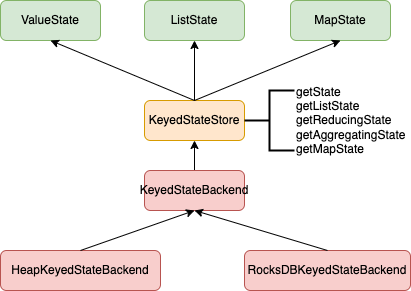

* 计算模型
  * DataStream基础框架
  * 事件时间和窗口
  * 状态和容错
* 部署&调度
* 存储体系
* 底层支撑

Flink中提供了State(状态)这个概念来保存中间计算结果和缓存数据，按照不同的场景，Flink提供了多种不同类型的State，同时为了实现Exactly once的语义，Flink参考Chandy-Lamport算法实现了Asynchronous Barrier Snapshotting算法(简称ABS)，本篇我们来了解Flink状态的底层实现及如何进行快照处理。

# 概述
Flink中提供了2种State，一种是Keyed State,是用在Keyed DataStream(即每条记录是有一个key)。即每个key对应有一个状态信息，用于数据处理场景中需要按key记录状态的场景，如风控场景下记录用户的状态，window操作中记录窗口的数据信息也是用keyed State来实现的。另一种是Operator State，即算子的状态，如在KafkaSource中记录消费的偏移量。本篇将从状态的管理、数据的存储和备份恢复等来介绍底层机制。

# State
## Keyed State
Keyed State按照存储数据类型的不同，分为如下几类
* ValueState: 保存一个值，支持查询和更新
* ListState: 保存一个元素列表
* ReducingState: 保存一个单值，表示添加到状态的所有数据的聚合,有定义一个ReduceFunction来进行聚合处理
* AggregatingState<IN, OUT>: 保留一个单值，也是添加到状态的所有数据的聚合，和ReducingState不同的是，输入数据和结果值的类型可以不同。
* MapState: 维护的一个映射列表
创建这些状态时需要同时定义一个StateDescriptor，这里面定义一个状态的名字(唯一名称)，通过StateDescriptor就可以来引用具体状态实例。

### 状态实例管理及数据存储
从Keyed State的定义来看，这里的关系应该是一个key到State的映射，而在使用时却没有看到这个key，另外具体的状态是如何保存的，本节我们来深入分析

从上图可以看出，各种不同的State，是通过KeyedStateStore来获取到的，KeyedStateStore只是一个代理类，其底层是调用KeyedStateBackend来负责具体的处理,具体的实现类有如下2个
 * HeapKeyedStateBackend: 基于内存的StateBackend，把数据保存在Java的Heap里面
 * RocksDBKeyedStateBackend: 状态数据保存在RocksDB中
  
下面我们从如下几个功能点来看具体各个StateBackend的实现
1. 各个实例的管理
2. 内部数据保存
3. 数据过期处理
4. 数据快照处理
5. 数据重分布
   

### HeapKeyedStateBackend
基于内存的StateBackend，将数据保存在Java的Heap中，适合小数据状态场景

1. 各个实例的管理
   ```
   private final Map<String, StateTable<K, ?, ?>> registeredKVStates;
   ```
   使用一个Map来保存各个不同的KeyedState，key为定义的名字，StateTable中存储的具体的数据。StateTable的内部在下面内部数据保存中介绍
  
2. 内部数据保存
   内部数据存储是通过StateTable来管理的，里面定义了一个StateMap的数组来存储具体的数据，具体的数据通过计算key的KeyGroupIndex来确定把数据存放到哪个StateMap。
   * StateMap:存储数据，具体的实现有CopyOnWriteStateMap和CopyOnWriteSkipListStateMap2个。
   * KeyGroup:将key分组管理，这样方便在后续通过savepoint来恢复任务时如果调整了并行度，这样方便对key按KeyGroup重新分布。keyGroup的计算为将key做hash处理后按最大并行度(maxParallelism)取余
3. 数据过期处理
   如果有设置了数据过期处理，这种生成的State会每个value都带上一个时间戳数据，如MapState是每个value都带一个时间戳，具体的实例类型也会不同，对应为如下几个
   * TtlValueState
   * TtlListState
   * TtlReducingState
   * TtlAggregatingState
   * TtlMapState
具体数据的清理处理通过TtlIncrementalCleanup类来实现
4. 数据快照处理
   HeapKeyedStateBackend的snapshot处理由类HeapSnapshotStrategy来负责，调用的方法为asyncSnapshot()，只支持全量的快照处理。
5. 数据重分布
   在实际的数据处理中由于并行度设置的不合理，在日常运维过程中会涉及到并行度的调整，算子的并行度调整后，那对key的分布也会进行调整，这样就会导致keyedState的数据进行重分布。Flink中引入了一个KeyGroup的概念，其对key做了个分组管理，KeyGroup的个数为最大并行度,具体实现为将key进行hash后然分类(hash值对KeyGroup数取余)到其中一个KeyGroup中。

### RocksDBKeyedStateBackend
使用RocksDB来存储状态，这个State backend可以存储非常大的状态，如果超过了内存可以split到磁盘上。同样我们分如下几个阶段来了解相关具体的实现
1. 各个实例的管理
  通过如下的Map来存储定义的各个状态信息，和前面HeapKeyedStateBackend类似，key为自己定义的名称
```
LinkedHashMap<String, RocksDbKvStateInfo> kvStateInformation;
```
2. 内部数据保存
从上面可以看到每个key对应的value是RocksDbKvStateInfo，这个其中有如下2个属性
ColumnFamilyHandle:rocksdb库中的类，提供了一个handle对应到rocksdb的ColumnFamily。
  ```
  public static class RocksDbKvStateInfo implements AutoCloseable {
          public final ColumnFamilyHandle columnFamilyHandle;
          public final RegisteredStateMetaInfoBase metaInfo;
  }
  ```
3. 数据过期处理
通过RocksDB的CompactionFilter[1]功能来实现数据过期的处理，RocksDB项目中专门有个FlinkCompactionFilter的类用于Flink项目
CompactionFilter提供了一种在rocksdb进行compaction时候，根据自定义逻辑去删除/修改key/value对的方法。如根据业务的ttl属性删除过期keys。
4. 数据快照处理
   RocksDBKeyedStateBackend支持2种快照处理方式，全量和增量，由于RocksDB底层是使用lsm树来进行存储的，所以比较方便实现增量数据的获取
5. 数据恢复处理
   和前面HeapKeyedStateBackend的类似，这里就不再展开了。

## OperatorState
接下面我们深入了解下OperatorState，在实际使用中如我们消费了kafka的数据需要记录kafka消费的offset，还有一些场景需要将一些信息分发到所有的任务。这里需要使用到一类新的状态处理，这种状态是与每个算子绑定的，Flink提供了如下3个类来支持
* ListState:通过一个list来保存相关的状态信息，如果并行度调整了，其中的数据按新的并行度重新进行分布处理；
* UnionListState: 保存数据时和ListState类似，但是在出错和从savepoint恢复数据时的策略会不一样，其会将所有的状态通过广播的方式发给下游的每个任务，然后下游的任务来选择自己需要的部分；
* BroadcastState: 用于每个任务上的状态都要一样的场景，这个在数据恢复时是把状态复制到所有的任务。
  
类似KeyedState，这里也是通过一个Backend来管理对应的状态数据，其接口定义为：OperatorStateStore。其实现类目前只有一个：DefaultOperatorStateBackend，我们也通过以下几个部分来分别了解DefaultOperatorStateBackend的实现
1. 各个实例的管理
```
private final Map<String, PartitionableListState<?>> registeredOperatorStates;

private final Map<String, BackendWritableBroadcastState<?, ?>> registeredBroadcastStates;
```
这里通过2个Map来分别管理ListState(含UnionListState,后面都统一使用ListState来代指)和BroadcastState。
2. 内部数据保存
   ListState的实现类为PartitionableListState，底层通过一个ArrayList来保存数据。BroadcastState定义的接口是kv的，所以其实现类HeapBroadcastState使用Map来存储相应的数据。
3. 数据过期处理
   operatorState不涉及到数据过期的处理
4. 数据快照处理
   DefaultOperatorStateBackendSnapshotStrategy类来负责具体的快照处理，调用的方法为asyncSnapshot，分别对ListState和BroadcastState进行快照处理
5. 数据重分布
   数据重分布的策略前面介绍各个State时已经介绍了，这里就不再重复介绍了。

## 上层封装
Flink中对状态的backend和checkpoint存储策略进行了封装定义。
StateBackend：定义一个Streaming应用的state如何在集群中的本地存储。不同的实现使用不同的数据结构来存储对应的状态。其具体实现有如下2个：
  * HashMapStateBackend：将状态保存在TaskManager的内存中(JVM heap)，其底层KeyedStateBackend使用的是HeapKeyedStateBackend，OperatorStateBackend使用的是DefaultOperatorStateBackend
  * EmbeddedRocksDBStateBackend：状态保存在一个嵌入的Rockdb实例中，其底层实现KeyedStateBackend使用的是RocksDBKeyedStateBackend，OperatorStateBackend使用的和HashMapStateBackend一致，也是DefaultOperatorStateBackend
  说明：原来的RocksDBStateBackend、FsStateBackend和MemoryStateBackend不建议使用了。
另外对checkpoint的存储，CheckpointStorage接口定义了在Streaming应用中StateBackend在容错性方面如何存储其状态数据。其实现有如下2个
* JobManagerCheckpointStorage：将checkpoints状态数据存储到JobManager的内存中，savepoints保存到文件系统
* FileSystemCheckpointStorage：将checkpoints状态存储到文件系统，如保存到HDFS上。

# 总结
本篇我们了解了Flink的相关的状态的内容和checkpoint的保存策略。
1. State分为KeyedState和OperatorState，KeyedState主要存储针对记录级别的状态，如window操作时的状态。OperatorState主要存储针对算子的状态，如消费kafka的offset信息等；每类状态分别提供了不同种类的状态类来支持不同场景的状态保存需求
2. Flink底层通过StateBackend来保存对应的状态数据，主要有通过内存保存和使用RocksDB保存这2类，另外在其具体实现中为了方便并行度调整后对状态的重新拆分处理，引入了KeyGroup的概念
3. 在用户使用层，对上述2种状态进行了封装，接口为：StateBackend，来管理KeyedState和OperatorState，另外将checkpoint的存储策略从原来的StateBackend中拆分出来。目前支持有基于内存和外部存储的2类checkpoint存储策略。
最后由于checkpoint的触发以及任务恢复的处理与整体计算处理比较紧密，这块等介绍完Flink部署模式后再来详细梳理checkpoint的处理过程。

参考文档
1. [RocksDB Compaction Filter](https://github.com/facebook/rocksdb/wiki/Compaction-Filter)