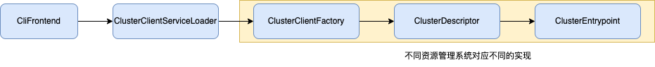

# 概览
本篇我们来了解Flink的部署模式和Flink集群的整体架构

# 部署模式

Flink支持如下三种运行模式
| 运行模式 | 描述 |
| --------| --|
| Application Mode | Flink Cluster只执行提交的整个job，然后退出；main方法在cluster中执行；支持yarn和k8s；官方建议yarn和k8s上的运行方式|
|pre-job mode | Flink Cluster只执行提交的整个job，然后退出；main方法在client中执行；支持yarn;官方建议yarn上运行方式, 该模式在Flink 1.15中被废弃了，建议用application mode|
|session mode | 支持在一个Flink Cluster中提交多个任务；main方法在client中执行；支持yarn和k8s|

Flink的部署步骤分为如下2步：
1. 部署启动一个Flink Cluster,负责接收job提交请求和管理job信息;
2. 向Flink Cluster提交job;
根据Flink Cluster可以运行的任务的数量(1个或多个)和提交job请求的地点(远端或Cluster端)的不同，从而有了不同的运行模式。由于pre-job模式已经被废弃了，下面我们主要来学习下Application mode和session mode

## Application mode
Application mode是Flink Cluster运行1个job，提交任务的地点为Cluster端。其提交方式如下
```
./bin/flink run-application -t yarn-application ./examples/streaming/TopSpeedWindowing.jar
```
其处理流程为，客户端提交部署请求，服务端启动Flink Cluster, 服务端运行Flink Application提交Job到Cluster。下面我们分析下具体实现细节。
### 客户端提交请求
通过flink命令提交请求，其运行的类为CliFrontend。为支持部署到不同的资源管理平台，所以有和对应资源管理系统交互的类，具体如下：

1. CliFrontend:flink命令对应的类，发起提交请求，后面session mode的提交Flink Application也是由该类负责
2. ClusterClientFactory:集群客户端工厂类，负责生成不同资源管理平台的客户端
3. ClusterDescriptor:负责和对应的资源管理平台交互，申请资源和提交请求
4. ClusterEntrypoint:在资源管理平台运行的类，启动Flink Cluster。
针对不同资源管理平台的对应实现类如下：

| 接口类 | yarn | kubernates |
| ----- | ----| ---- |
| ClusterClientFactory | YarnClusterClientFactory | KubernetesClusterClientFactory |
| ClusterDescriptor | YarnClusterDescriptor | KubernetesClusterDescriptor |
| ClusterEntrypoint | YarnApplicationClusterEntryPoint | KubernetesApplicationClusterEntrypoint |

### 服务端启动&提交Application
服务端启动对应的ClusterEntrypoint，其中会启动一个REST Server来接受提交Flink Application，另外有个Dispatcher负责作业的调度，其他部分后面我们分析运行流程时再展开介绍。作业的提交请求是在Dispatcher中的DispatcherBootstrap属性实例化的时候触发。
Flink Application运行时，是在StreamExecutionEnvironment.execute()方法来触发实际提交，提交相关的调用链如下：

这几个都是接口类，在Application模式下对应的实现类如下
| 接口类 | 实现类|
| --- | ---| 
|PipelineExecutorServiceLoader | EmbeddedExecutorServiceLoader |
| PipelineExecutorFactory | EmbeddedExecutorFactory |
| PipelineExecutor | EmbeddedExecutor |

## session mode
session mode是一个Flink Cluster可以来运行多个Flink job。那这里的提交会分为2个步骤
```
// 提交启动session cluster
// yarn session
./bin/yarn-session.sh --detached
// kubernates session
./bin/kubernetes-session.sh -Dkubernetes.cluster-id=my-first-flink-cluster

// 提交job
./bin/flink run ./examples/streaming/TopSpeedWindowing.jar
```
1. 通过yarn-session.sh (或kubernates-session.sh) 来提交部署Flink Cluster,这块和前面application mode类似，以yarn模式为例，底层也是调用了YarnClusterDescriptor来提交相应的请求，提交到服务器的是YarnSessionClusterEntrypoint类。
2. 提交Job，这块是在client端来单独提交的，直接提交信息到服务器的REST Server，根据提交的目标资源管理系统的不同，使用了不同的实现类

| 接口类 | 实现类yarn| 实现类kubernates |
| --- | ---| -- |
|PipelineExecutorServiceLoader | DefaultExecutorServiceLoader | DefaultExecutorServiceLoader|
| PipelineExecutorFactory | YarnSessionClusterExecutorFactory | YarnSessionClusterExecutorFactory | 
| PipelineExecutor | YarnSessionClusterExecutor | KubernetesSessionClusterExecutor|

# Cluster架构
Flink是一个Master/Worker的架构，Master节点负责整个任务的管理，Worker节点负责执行对应的任务。其整体结构如下：

* JobManager: Master节点的统称，目前版本没有该类，其中有几个重点的服务，如上图所示，目前的代码中对应的组合了这些服务的类为：DispatcherResourceManagerComponent。
* Dispatcher: Job调度器，负责接收Job的提交，保存Job和管理JobMaster来执行作业。前面我们提到的提交作业到Cluster，实际上是提交给了Dispatcher的。
* ResourceManager: 负责和不同的资源调度系统交互，管理资源申请。
* WebMonitorEndpoint: 负责web界面的Rest请求处理
* JobMaster: 负责运行单个JobGraph，包括TaskManager的管理，任务的调度等。
* TaskManager: 负责任务的执行，也没有TaskManager的类，对应的类为TaskExecutor，来执行多个Task

说明：JobManager可能是原来的JobMaster，具体通过Dispatcher.java的如下代码可以看出，重点在对其具体结构的理解，这个变化的逻辑我们就不考究了。
```
 private JobManagerRunner createJobMasterRunner(JobGraph jobGraph) throws Exception
```

## Cluster的启动流程
上面介绍了Cluster的整体架构，接下来我们看看Cluster的启动流程。以Application mode部署到Yarn为例(其他模式的启动类似，只是启动的主类不同)。该方式下的主类为：YarnApplicationClusterEntryPoint，其内部调用了ClusterEntrypoint的方法，最终是通过ClusterEntrypoint类的runCluster()方法来创建DispatcherResourceManagerComponent对象。

## DispatcherResourceManagerComponent
接下来我们看看DispatcherResourceManagerComponent中的具体属性信息
```
    @Nonnull private final DispatcherRunner dispatcherRunner;

    @Nonnull private final ResourceManagerService resourceManagerService;

    @Nonnull private final RestService webMonitorEndpoint;

    @Nonnull private final LeaderRetrievalService dispatcherLeaderRetrievalService;

    @Nonnull private final LeaderRetrievalService resourceManagerRetrievalService;
```

### Runner代码
这里我们并没有看到Dispatcher，而是一个类似名字的DispatcherRunner.DispatcherRunner是来管理Dispatcher如何运行的。类似ResourceManagerService是来管理ResourceManager的生命周期的。

### HA代码框架
另外由于这些服务都有双机容错机制(HA), 所以这里在看相关代码的时候会产生一定的干扰，本篇的最后我们来介绍下这块HA的相关的机制，这样对大家来梳理相关的流程会更清晰。
Leader的选举，是通过LeaderElectionService(选举服务，实现类为DefaultLeaderElectionService)和LeaderContender(竞选者)共同来完成的。具体过程为LeaderElectionService.start(LeaderContender)，启动选举服务，传入LeaderContender信息，等选举成功后，会回调LeaderContender的grantLeadership()方法，Flink中相关的服务都实现了LeaderContender接口。所以理清这个逻辑后，我们在看到相关服务的start()方法中只调用了leaderElectionService.start方法时也不用懵了，直接看该服务的grantLeadership方法来梳理逻辑。
LeaderElectionDriver：进行Leader的选举和保存Leader的信息，具体的实现有ZooKeeperLeaderElectionDriver和KubernetesLeaderElectionDriver

那如何获取Leader的地址呢，也提供了相应的接口LeaderRetrievalService和LeaderRetrievalLister，启动一个对Leader地址的监听，leader有变化时会得到通知。

# 总结
本篇我们了解了Flink的部署模式，按Job提交方式和一个集群可同时运行任务的数量的不同，分为ApplicationMode和SessionMode2种模式。接着介绍了Cluster的整体架构和启动流程，主要包括Dispatcher、ResourceManager和WebMonitorEndpoint。最后介绍了HA处理的整体框架，便于大家更好的梳理核心流程。