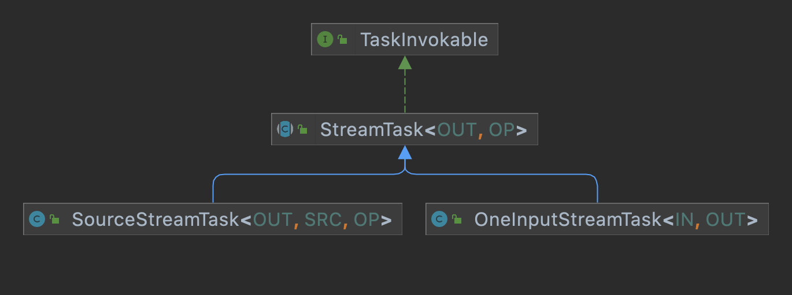
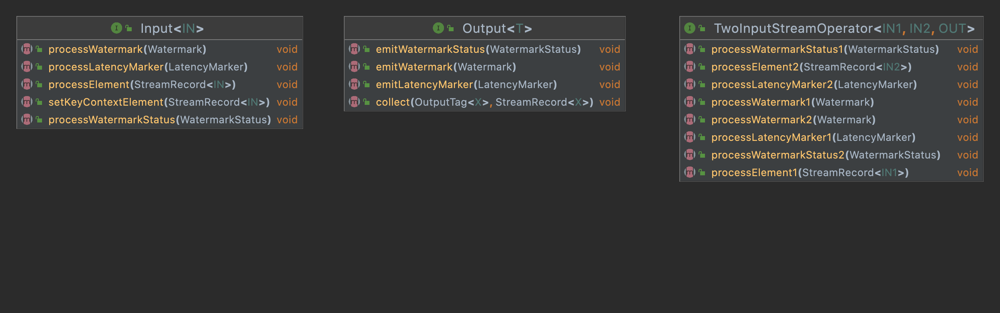

上一篇我们分析了Flink部署集群的过程和作业提交的方式，本篇我们来分析下，具体作业是如何被调度和计算的。具体分为2个部分来介绍
    * 作业运行的整体框架，对相关的重要角色有深入了解
    * 计算流程，重点是如何调度具体的operator机制


# 概览
首先我们来了解下整体的框架
JobMaster: 计算框架的主节点，负责运行单个JobGraph，包括任务的调度，资源申请和TaskManager的管理等。
TaskExecutor: 负责多个Task的具体执行
Dispatcher接收到submitJob的请求后，会生成一个JobMaster实例(具体为Dispatcher创建JobManagerRunner,JobManagerRunner创建JobMaster),下面来具体介绍下JobMaster和TaskExecutor的内部信息

# 调度框架
### JobMaster
```
    private final SchedulerNG schedulerNG;

    private final ShuffleMaster<?> shuffleMaster;

    private final SlotPoolService slotPoolService;

    private final LeaderRetrievalService resourceManagerLeaderRetriever;

    private final BlobWriter blobWriter;

    private final JobMasterPartitionTracker partitionTracker;

    private HeartbeatManager<TaskExecutorToJobManagerHeartbeatPayload, AllocatedSlotReport>
            taskManagerHeartbeatManager;
    
    private HeartbeatManager<Void, Void> resourceManagerHeartbeatManager;
```
JobMaster作为整个任务调度计算的主节点，需要和一些外部角色进行交互，具体的如下：

* resourceManagerLeaderRetriever: 负责和resourceManager间的通讯
* slotPoolService: 用于管理slotpool的，slot资源管理，负责slot的申请、释放等。
* partitionTracker: 负责算子计算结果数据分区的跟踪
* schedulerNG：内部的调度引擎，负责job的调度处理
* shuffleMaster: 数据shuffle处理
* taskManagerHeartbeatManager:记录和taskManager间的心跳信息，
* resourceManagerHeartbeatManager：记录和resourceManager间的心跳

### ScheduleNG
ScheduleNG实际负责job调度处理，包括生成ExecutionGraph，作业的调度执行，任务出错处理等。其实现类为DefaultScheduler
* SchedulingStrategy：任务调度的策略,实现类为PipelinedRegionSchedulingStrategy,按pipeline region的粒度来调度任务
* ExecutionGraphFactory:其实现类为DefaultExecutionGraphFactory，创建ExecutionGraph的工厂类

### TaskExecutor 
实际任务运行的节点，该类负责多个任务的运行，首先我们看看其实现了TaskExecutorGateway接口，TaskExecutorGateway定义了各类可以调用的功能接口，具体内容见下表
| 分类 | 方法名 | 说明|
| --- | --- | --- |
| Task操作相关 | SubmitTask | 向TaskExecutor提交任务 |
| Task操作相关 | cancelTask | 取消指定的任务 |
| Task操作相关 | sendOperatorEventToTask | 发送算子事件给Task |
| Slot操作相关 | requestSlot | 给指定的Job分配指定的slot |
| Slot操作相关 | freeSlot | 释放对应的slot |
| Slot操作相关 | freeInactiveSlots | 释放指定Job的未使用的slot |
| Partition操作相关 | updatePartitions | 更新分区信息 |
| Partition操作相关 | releaseOrPromotePartitions | 批量释放或保留分区|
| Partition操作相关 | releaseClusterPartitions | 释放属于给定datasets的所有集群分区数据 |
| checkpoint操作相关 | triggerCheckpoint | 触发指定任务的checkpoint处理 |
| checkpoint操作相关 | confirmCheckpoint | 确认指定任务的checkpoint |
| checkpoint操作相关 | abortCheckpoint | 终止给定任务的checkpoint |

### Task
一个Task负责TaskManager上一个subtask的一次执行，Task对Flink Operator进行包装然后运行，并提供需要的各类服务，如消费输入数据，生产数据以及和JobManager通讯。Task实现了Runnable接口，即通过一个单独的线程来运行，而其中的Flink Operator部分封装在实现了TaskInvokable接口的类中，实现类主要为SourceStreamTask和OneInputStreamTask。下面分别详细介绍下这几个类
* Task: 对应为一个线程，来运行具体的Operator的逻辑，并包括相关的其他的辅助功能，包括如执行状态的管理、结果数据管理(ResultPartitionWriters)、输入数据(IndexInputGate)以及生成封装了Operator逻辑的TaskInvokable实例并运行
* TaskInvokable：封装了具体Operator的处理逻辑，主要包括有2个方法，restore()和invoke()。restore()方法在invoke()之前调用，用于恢复上次的有效状态。invoke()方法执行具体的处理逻辑。下面我们看看其实现子类(这里只列了与StreamGraph相关的实现类，对于其他的子类没有展示)

  * SourceStreamTask：用于执行StreamSource，即源头的读取数据类Operator
  * OneInputStreamTask：用于执行OneInputStreamOperator，即只有一个输入的operator
  * TwoInputStreamTask: 用于执行TwoInputStreamOperator，有2个输入的operator
  * MultipleInputStreamTask: 用于执行MultipleInputStreamOperator，有多个输入的operator

# 计算框架
计算框架这节主要来了解数据是如何在Flink中如何处理和流转的。这里我们主要回答以下几个问题：
1. Flink中整个数据的处理流程，单条数据是如何在各个算子间流转和处理的
2. 对于算子chain和其他算子其底层实现区别是怎样的，为何chain后的效率会高
我们先以StreamMap算子为例来看整体计算框架的设计
```
public class StreamMap<IN, OUT> extends AbstractUdfStreamOperator<OUT, MapFunction<IN, OUT>>
        implements OneInputStreamOperator<IN, OUT> {

    private static final long serialVersionUID = 1L;

    public StreamMap(MapFunction<IN, OUT> mapper) {
        super(mapper);
        chainingStrategy = ChainingStrategy.ALWAYS;
    }

    @Override
    public void processElement(StreamRecord<IN> element) throws Exception {
        output.collect(element.replace(userFunction.map(element.getValue())));
    }
}
```
这里StreamMap实现了Input接口，其中在实现的processElement()方法中实现了具体的对具体数据的操作处理(Operator)，并将结果通过Output接口的collect()方法发射出去。我们先看看这2个接口定义的方法

基本上2边是一一对应的关系，Input负责处理Element\Watermark\WatermarkStatus\LatencyMarker,而Output负责emit这些。这里Input是处理一个输入的，如果是2个输入那对应的就是TwoInputStreamOperator
### 算子计算处理
对于Chain的操作，是通过Output接口的实现类ChainingOutput.java
```
    // ChainingOutput.java
    @Override
    public void collect(StreamRecord<T> record) {
        pushToOperator(record);
    }

    protected <X> void pushToOperator(StreamRecord<X> record) {
        try {
            ...
            input.setKeyContextElement(castRecord);
            input.processElement(castRecord);
        } catch (Exception e) {
            throw new ExceptionInChainedOperatorException(e);
        }

```
这里可以看到在output.collect()方法中把数据再推送到了算子,然后算子(input)继续执行processElement()这样来实现了在当前线程内的pipeline处理，

# 总结
本篇我们介绍了Flink是如何来执行相应的算子来实现计算的，主要介绍了TaskExecutor运行的Task实现，以及chain算子是如何串行来运行的。对于算子之间的数据交互这块我们后面一篇来单独介绍。