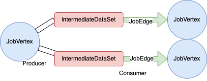

上一篇我们了解了Flink作业运行的整体计算流程，本篇文章我们来学习下task间数据传输的具体实现。由于不同的task会运行在同一个TaskManager,也可能运行在不同的TaskManager，所以这里会存在网络通讯的处理，另外上下游的task也会涉及到数据的重分布处理，还有就是如果上游数据量有较大波动时，会存在的背压处理。本篇文章通过从Flink的上层数据传输设计开始，逐步深入分析到底层的数据传输的具体实现。

# 概览

首先我们来了解下Flink中涉及到数据交换的地方。先我们看看在JobGraph中对于中间数据的定义，IntermediateDataset是在JobGraph中JobVertex与其他JobVertex间的数据中间结果，一个IntermediateDataset表示JobVertex的一个数据输出，JobEdge对应来消费一个IntermediateDataset的数据，
最后JobEdge是定义的JobVertex的一个数据输入。

而对应到ExecutionGraph中对ntermediateDataset数据进行了展开。一个JobVertex对应到一个ExecutionJobVertex，而一个IntermediateDataset对应到一个IntermediateResult。由于ExecutionJobVertex会有多个subTask来执行，所以有多个IntermediateResultPartition来组成一个IntermediateResult

## subTask数据交互
每个subTask的数据交互是一个生产者消费者模型，首先我们看生产端部分，具体到每个subTask，生产的数据放入ResultPartition(继承了接口ResultPartitionWriter，该接口定义了数据的写入，刷新处理等接口)中，一个ResultPartition中会有1个或多个ResultSubPartition,如这个subTask的结果下游会有多个subTask使用的情况，会有多个ResultSubPartition。另在StreamTask(07-作业运行中介绍的TaskInvokable接口的抽象类)中有一个RecordWriter，该类对ResultPartitionWriter进行了封装，负责指定数据写入的对应的通道(即哪个ResultSubPartition)
在消费端部分是InputGate和InputChannel，InputGate负责和一个或多个ResultPartition对接，来消费其中的数据，其内部有多个InputChannel，每个InputChannel对应消费一个ResultSubPartition的数据，这里具体是通过了一个ResultSubpartitionView来消费数据的。针对本地数据和远端数据的情况，InputChannel分别实现了LocalInputChannel和RemoteInputChannel

# 数据传递流程
通过上面我们大致了解了Flink中整个数据传递的整体框架和主要的类，下面我们通过具体一条数据的处理过程来深入了解Flink中的数据传递细节。

## 生产数据处理
### 创建实例
#### ResultPartition
通过前面的07-作业运行的介绍是Task类提供了生产数据和消费数据，这里ResultPartition(ResultPartition继承了ResultPartitionWriter接口)和InputGate的实例是在Task实例的初始化方法中创建了对应的实例，具体相关的代码如下：
```
    private final ResultPartitionWriter[] consumableNotifyingPartitionWriters;

    public Task(...){
        final ResultPartitionWriter[] resultPartitionWriters =
                shuffleEnvironment
                        .createResultPartitionWriters(
                                taskShuffleContext, resultPartitionDeploymentDescriptors)
                        .toArray(new ResultPartitionWriter[] {});

        this.consumableNotifyingPartitionWriters =
                ConsumableNotifyingResultPartitionWriterDecorator.decorate(
                        resultPartitionDeploymentDescriptors,
                        resultPartitionWriters,
                        this,
                        jobId,
                        resultPartitionConsumableNotifier);

    }
```
这里通过ShuffleEnvironment的相关方法来创建了生产者和消费者，ShuffleEnvironment的实现类为NettyShuffleEnvironment，通过netty来进行数据通讯。ResultPartitionFactory中根据不同的ResultPartitionType类型会生成不同的ResultPartitionWriter实例，通过下表，我们来了解下不同的ResultPartitionType类型和对应的ResultPartitionWriter(ResultPartition).
ResultPartitionType类型：
| 类型 | 说明 | 对应ResultPartition |
| --- | --- | ---------- |
| PIPELINED | 流水线数据交换，只支持消费一次 | PipelinedResultPartition |
| PIPELINED_BOUNDED | 带一个有界限大小buffer pool的流水线 | PipelinedResultPartition |
| PIPELINED_APPROXIMATE | 前面pipeline的数据只能被消费一次，这个类型支持下游task失败后重连接处理 | PipelinedResultPartition |
| BLOCKING | 阻塞数据交换，数据先都生产完了再进行消费处理，支持消费多次 | SortMergeResultPartition |
| BLOCKING_PERSISTENT | 和BLOCKING类似，另外有一个用户自定义的数据生命周期 | SortMergeResultPartition |

* PipelinedResultPartition: 通过数据流的方式把数据给到下游接受者。同时支持batch和streaming2个场景
* SortMergeResultPartition: 针对批量数据场景，数据先写入buffer，如果buffer写满了，将buffer的数据写入到一个PartitionFile中。

#### RecordWriter
RecordWriter对ResultPartitionWriter进行了封装，在数据写入处理时提供了附加的一些功能，包括分区的选择，record序列化和自动刷新处理。RecordWriter是在StreamTask中进行实例化的，根据输出数据的不同，可以实例化为BroadcastRecordWriter和ChannelSelectorRecordWriter。
 * BroadcastRecordWriter: 根据名字可以看出数据通过广播的方式写入下游
 * ChannelSelectorRecordWriter:根据其中的ChannelSelector的策略来分发数据，这里ChannelSelector即数据分区的方式，Flink中提供了丰富的ChannelSelector实现类，如RoundRobin、KeyGroup、hash、Global等。
序列化处理，使用了类DataOutputSerializer来对各个不同的类型进行序列化处理。
数据刷新，支持低延迟的数据流处理场景，在指定timeout周期调用flushAll()处理。这里负责的类为OutputFlusher。

### 数据写入
RecordWriter调用emit()方法写入数据，内部调用了ResultPartitionWriter的emitRecord()方法。这里我们以PipelineResultPartition的方式为例(数据流处理方式)来介绍数据的流转过程。PipelineResultPartition继承了BufferWritingResultPartition抽象类，具体emitRecord()的实现在BufferWritingResultPartition类中。我们来看看BufferWritingResultPartition的细节来了解。
```
    // 非广播模式
    private final BufferBuilder[] unicastBufferBuilders;

    // 广播模式使用一个单一的BufferBuilder
    private BufferBuilder broadcastBufferBuilder;
```
BufferWritingResultPartition中使用BufferBuilder来负责管理具体的数据信息。针对广播模式和非广播模式分别使用了不同的属性来管理，非广播模式使用一个BufferBuilder数组来管理不同subPartition的数据。
BufferBuilder中定义了一个MemorySegment来存放数据，另外通过SettablePositionMarker来管理当前数据写入的位置，以及标识为完成。MemorySegment对内存使用做了一层封装，可以支持堆内存、堆外内存的使用。MemorySegment的概念上类似java.nio.ByteBuffer，但是提供了一些新的内容，如binary compare、swap、copy新的方法, 大批数据的put和get，还有一些其他的特性，具体大家看注释中的如下这段描述
```
 * <p>This class fulfills conceptually a similar purpose as Java's {@link java.nio.ByteBuffer}. We
 * add this specialized class for various reasons:
 *
 * <ul>
 *   <li>It offers additional binary compare, swap, and copy methods.
 *   <li>It uses collapsed checks for range check and memory segment disposal.
 *   <li>It offers absolute positioning methods for bulk put/get methods, to guarantee thread safe
 *       use.
 *   <li>It offers explicit big-endian / little-endian access methods, rather than tracking
 *       internally a byte order.
 *   <li>It transparently and efficiently moves data between on-heap and off-heap variants.
 * </ul>
 ```
 另外这里在创建一个新的BufferBuilder后，会闯将一个BufferConsumer,然后会调用ResultSubPartition的add()方法，将这个BufferConsumer放入，这块后面在数据刷新和数据消费时会用到。

### 数据就绪
这里数据就绪，即数据准备好了，然后通知下游可以来消费使用了，具体为调用ResultPartitionWriter的flush()或flushAll()方法或finish()方法。flush()方法实际会调用到ResultSubPartition的flush()方法，这里会调用到在ResultSubPartition创建了ResultSubpartitionView(下游消费使用)的notifyDataAvailable()方法，来通知数据可用了。finish()方法也是类似。

最后这里要介绍下ResultPartitionManager类，该类负责跟踪一个TaskManager下的所有的生产和消费partitions的信息。后续的消费者通过调用该类的createSubpartitionView()方法来创建ResultSubpartitionView实例。

## 消费数据处理
### 创建实例
同样在Task类中也创建了InputGate数组来负责获取上游的数据。
 ```
     private final IndexedInputGate[] inputGates;

     public Task(...){
         // consumed intermediate result partitions
        final IndexedInputGate[] gates =
                shuffleEnvironment
                        .createInputGates(taskShuffleContext, this, inputGateDeploymentDescriptors)
                        .toArray(new IndexedInputGate[0]);
    }

```
InputGate有2个实现SingleInputGate和UnionInputGate，这里以SingleInputGate为例来介绍具体实现信息。SingleInputGate中有一个InputChannel数组，分别对应上游的需要获取数据的ResultSubPartition。

### 数据获取
首先调用InputGate的requestPartitions(),其内部会调用InputChannel的requestSubpartition(),requestSubpartition()方法内部会和ResultPartitionManager联系创建ResultSubpartitionView(分本地和远端2种)
通过调用InputGate的getNext()方法来获取数据，里面会调用InputChannel的getNextBuffer()的方法来获取数据。由于上游的Task有在本地和远端的情况，所以InputChannel的实现有LocalInputChannel和RemoteInputChannel。下面我们分别来看看其处理实现。
#### LocalInputChannel
负责处理上游数据也在本地的场景。那在requestSubpartition()中是直接调用了ResultPartitionManager的createSubpartitionView方法。同时这里LocalInputChannel实现了BufferAvailabilityListener接口，这个会传入createSubpartitionView，供ResultSubpartitionView收到数据就绪后的回调。获取数据也直接通过调用LocalInputChannel的getNextBuffer()来获取, 其中调用了ResultSubpartitionView的getNextBuffer()来获取数据。

#### RemoteInputChannel
如果上下游的需要数据传递的任务不在同一个TaskMananger上，那就需要通过网络来传输数据了，具体底层是使用netty来实现的。RemoteInputChannel中有一个PartitionRequestClient来负责和远端进行通讯，服务器端通过PartitionRequestServerHandler来处理接收的请求，PartitionRequestServerHandler类实现了SimpleChannelInboundHandler抽象类(netty中的抽象类，Handler作为netty中的一个概念，负责事件的处理，具体详情大家可以参考netty资料)。
```
RemoteInputChannel.java
    public void requestSubpartition() throws IOException, InterruptedException {
            ...
            partitionRequestClient.requestSubpartition(
                    partitionId, consumedSubpartitionIndex, this, 0);
        }
    }

```

## 背压处理
由于任务处理逻辑的不同，会存在上游产出数据下游无法及时消费的情况，这样会出现数据堆积的情况，在Flink中称为背压(Backpressure)，前面申请新BufferBuilder时，会通过BufferPool.requestBufferBuilderBlocking方法来申请，其中会去申请MemorySegment，如果没申请到就会一直阻塞，如果下游使用完了会释放使用的MemorySegment。这里存在一个TaskManager中由于内容复用导致的相互之间的影响：
1. 每个TaskManager中复用一个NetworkBufferPool，这样如果出现背压会导致一个任务把NetworkBufferPool申请完，而其他Task也申请不到资源的情况。
2. 每个TaskManager中复用一个NettyClient，如果下游缓存不够，会导致NettyClient一直被占用的情况。

我们看看Flink中是如何解决这2个问题的
* 问题一: NetworkBufferPool用完的问题，这里针对每个生产者ResultPartition里面分别定义了一个LocalBufferPool，LocalBufferPool向NetworkBufferPool申请MemorySegment, 但是会有一个限制的数量(由参数taskmanager.network.memory.max-buffers-per-channel控制)
* 问题二: 在Flink1.5版本的时候添加了credit-based flow control(基于信用值的流量控制)来解决阻塞的问题。其基本思路是
    1. 接收端向服务端声明一个可用的credit(这个credit的值即为可用的networkBuffer的个数，初始值由参数taskmanager.network.memory.buffers-per-channel配置)
    2. 当服务端收到这个数据后，只有credit>0的情况才会发送buffer，每发送一个buffer对应credit的值就相应减一
    3. 如果是事件类数据则不受credit的控制
    4. 服务端反馈数据时，同时也会把当前堆积的数量发送给接收端，这样接收端可以根据此数据来扩充本地的缓存。
针对问题二，我们看看具体的实现。
首先看接收端向服务端发送消息的情况，这里是使用NettyMessage来发送的，我们看看与上述相关的消息
* PartitionRequest: 申请ResultSubPartition, 这里附带了一个参数为credit，即初始时credit的大小。
* AddCredit: 如果收到服务端目前堆积的数据后，扩充了的NetworkBuffer的大小。
而在服务端，收到的请求数据统一由CreditBasedSequenceNumberingViewReader来负责处理。其中有个属性numCreditsAvailable来记录当前可用的credit的值。
```
class CreditBasedSequenceNumberingViewReader
        implements BufferAvailabilityListener, NetworkSequenceViewReader {
    
    // 收到PartitionRequest请求后会初始化一个CreditBasedSequenceNumberingViewReader实例
    CreditBasedSequenceNumberingViewReader(
            InputChannelID receiverId, int initialCredit, PartitionRequestQueue requestQueue) {
        checkArgument(initialCredit >= 0, "Must be non-negative.");

        this.receiverId = receiverId;
        this.initialCredit = initialCredit;
        this.numCreditsAvailable = initialCredit;
        this.requestQueue = requestQueue;
    }

    public BufferAndAvailability getNextBuffer() throws IOException {
        BufferAndBacklog next = subpartitionView.getNextBuffer();
        if (next != null) {
            if (next.buffer().isBuffer() && --numCreditsAvailable < 0) {
                throw new IllegalStateException("no credit available");
            }
            ...
        } else {
            return null;
        }
    }

    @Override
    public void addCredit(int creditDeltas) {
        numCreditsAvailable += creditDeltas;
    }
```
这里相关的处理逻辑如下：
  * 收到PartitionRequest请求后会初始化一个CreditBasedSequenceNumberingViewReader实例，numCreditsAvailable值为请求中的credit大小
  * 获取一次buffer后相应的把numCreditsAvailable减一
  * 收到AddCredit请求后相应调用addCredit方法，增加numCreditsAvailable的值

# 总结
在本篇中详细分析了Flink的各个Task间数据传递的实现，首先介绍了数据传递处理的生产者消费者模式，并分别详细介绍了生产者端ResultPartition和RecordWriter，消费者端InputGate和InputChannel，另外针对Flink中的背压处理，详细介绍了其实现逻辑，以及其中存在的一些问题，分析了对应Flink的处理方案。

参考资料：
1. [Flink重点原理与机制 | 网络流控及反压机制](https://blog.51cto.com/u_9928699/3772715)