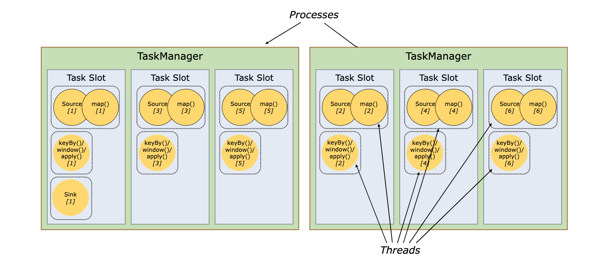

Flink支持部署到Yarn和kubernates等资源管理集群，而Flink中是如何确定需要的资源的大小，如何控制分配任务到不同的节点呢，本篇将带您深入了解其中的机制

# 概览
首先我们通过官方文档来了解下Flink中对于资源的定义，Flink中定义了一个Slot的概念来作为资源管理的最小单位，一个TaskManager中可以有1个或者多个Slot(通过参数taskmanager.numberOfTaskSlots来配置，默认为1)，每个Slot中可以运行1个或多个subtask(如果开启了slot共享)

这里有几个概念单独说明下
* subtask:前面我们介绍了jobGraph和ExecutionGraph，每个ExecutionGraph的节点对应的就是一个subtask，或简单点讲就是算子并行化后的每个单独的实例对应一个subtask(当然这里由于会对算子做Chain的处理，这里对应的就是一个chain的并行化)。
* slot:为了控制在一个TaskManager中可以执行的任务数(这个任务是指同样逻辑的任务)，所以添加了一个slot的概念，同一个TaskManager里面的slot共享其中的资源。默认是平均分配的，但现在为满足更灵活的资源分配需求，也增加了Fine-Grained Resource Management。
如果开启了slot共享，那可以在一个slot中运行多个subtask，这里指在同一个Job下的不同task的子任务。允许slot共享有如下好处：
1. 流水线上的任务都在同一个TaskManager运行，这样可以避免不同任务之间的数据网络通讯开销；
2. 更合理的资源使用，由于不同任务使用的资源间会存在差异，如果不支持slot共享，那所有的subtask都使用同样大小的资源，这样会存在资源的浪费。

这样Flink中分为2层的资源管理，一层是对Slot的，另一层是实际的cpu内存等。下面我们通过对任务的资源申请流程和具体的资源管理模块来介绍内部实现。

# 资源申请流程
这里我们从JobMaster线程启动开始介绍(JobMaster相关内容参加07-作业运行)。 JobMaster启动后会调用内部ScheduleNG(实现类DefaultScheduler)的startScheduling()方法，里面再调用SchedulingStrategy(实现类PipelinedRegionSchedulingStrategy)的startScheduling()，该方法分2个步骤：1. 生成需要计算的数据流 2.调度运行,其中包含了资源申请的处理
```
    //PipelinedRegionSchedulingStrategy.java
    @Override
    public void startScheduling() {
        final Set<SchedulingPipelinedRegion> sourceRegions =
                IterableUtils.toStream(schedulingTopology.getAllPipelinedRegions())
                        .filter(this::isSourceRegion)
                        .collect(Collectors.toSet());
        maybeScheduleRegions(sourceRegions);
    }
```
第一步是直接生成了所有的PipelineRegion，每个PipelineRegion即对应一个流水线，里面包含所有要执行的ExecutionVertex(即并行实例化后的所有的subtask任务)。下面看第二步针对每条流水线region进行调度，这里实际调用的是DefaultScheduler.allocateSlotsAndDeploy()方法。
## task的slot分配
哪些subtask可以分配到同一个slot中呢，这个是通过ExecutionSlotAllocator接口的allocateSlotsFor()方法来处理的。这里涉及如下类
### SlotSharingExecutionSlotAllocator
ExecutionSlotAllocator接口的实现类，通过名字可以看出，是处理共享可执行slot分配的。
看名字可以看出是负责共享slot分配类，allocateSlotsFor()方法中，首先根据策略来计算分组。接口SlotSharingStrategy，其实现类为


LocalInputPreferredSlotSharingStrategy 计算可以在同一个slot上运行的subtask


1. Flink的资源分配机制
2. slot与底层具体物理资源的对应关系
3. 新的资源优化方向


Task slot taskmanager

YarnWorkerResourceSpecFactory 计算每次申请需要的资源


参考资料：
1. https://nightlies.apache.org/flink/flink-docs-release-1.15/zh/docs/concepts/flink-architecture/
2. 