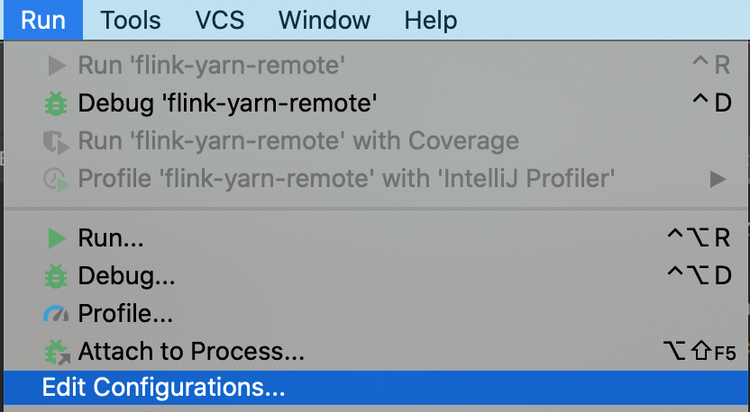
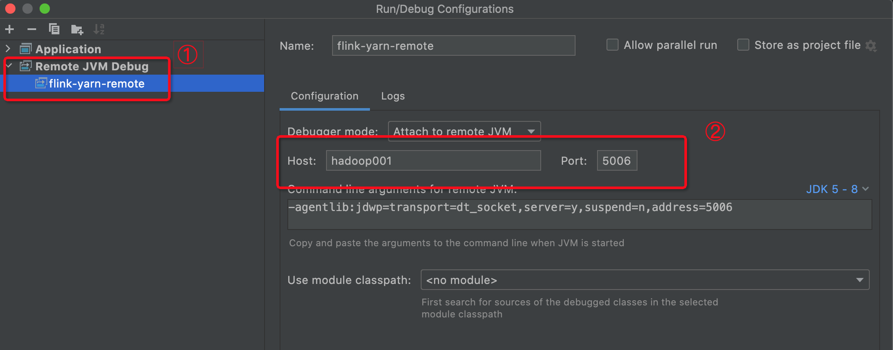
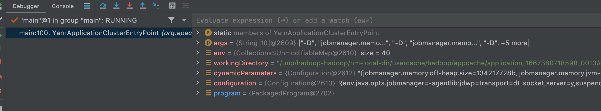

在学习Flink的源码中，如果直接看源码来学习，此块效率是比较低的，特别是其中涉及很多状态数据和使用接口类的情况，理解起来比较困难，所以我们会通过调试的方式来查看具体的流程和其中的数据。而在Flink发布部署的时候此块是发布到远端的，不能进行本地的调试。这里记录下如何进行远端调试的配置。

### Flink提交端
在Flink任务提交端修改Flink-conf.yaml文件，配置remote debug相关参数
```
# jobmanager debug端口
env.java.opts.jobmanager: "-agentlib:jdwp=transport=dt_socket,server=y,suspend=n,address=5006"
#  taskmanager debug端口
env.java.opts.taskmanager: "-agentlib:jdwp=transport=dt_socket,server=y,suspend=n,address=5005"
# 设置cliFrontend 客户端的debug端口，这个是在客户端上执行的，如果不是调试客户端提交过程，把下面的注释掉
env.java.opts.client: "-agentlib:jdwp=transport=dt_socket,server=y,suspend=y,address=5008"

# 设置超时 时间 . 单位 毫秒.
rest.connection-timeout: 360000000
rest.idleness-timeout: 360000000
```
注意：这里的端口不要和远端服务器上的端口冲突了

### IDEA配置
这里以IntelliJ IDEA为例来介绍配置调试环境
1. 点击Run->Edit Configurations...
   
2. 添加remote JVM debug，然后配置相应的参数
3. 

### 示例
1. flink提交命令，这里以application mode举例
   ```
   ./bin/flink run-application -t yarn-application ./examples/streaming/TopSpeedWindowing.jar
   ```
   等命令提交后就可以进入下一步，通过IDEA来连接远程的服务了。如果连接不上，可登录yarn的nodemanager的机器查看对应的进程信息
2. IDEA中给YarnApplicationClusterEntryPoint.java(这里我们使用的是application mode，所以是这个文件，如果是其他的模式选对应的文件)文件中添加断点，然后点击debug进行调试，最终显示如下
   

这样我们就可以比较愉快的来学习源码了